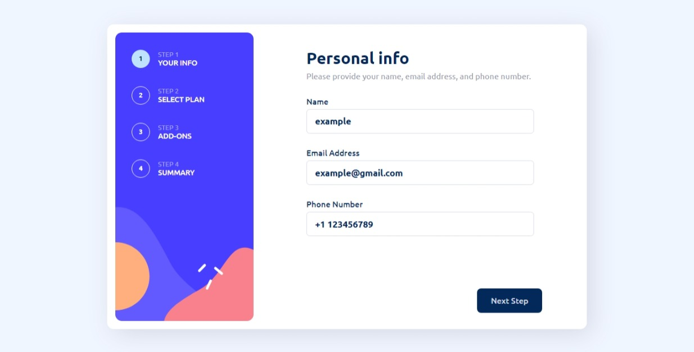
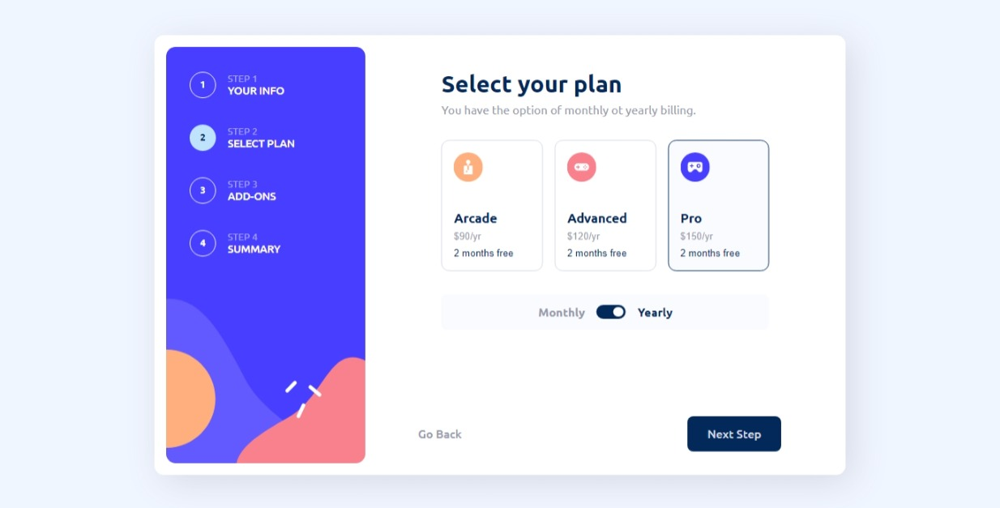
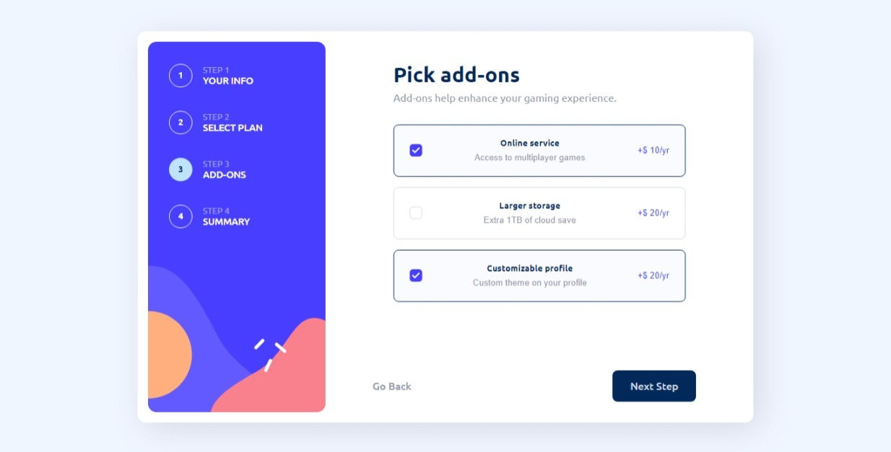
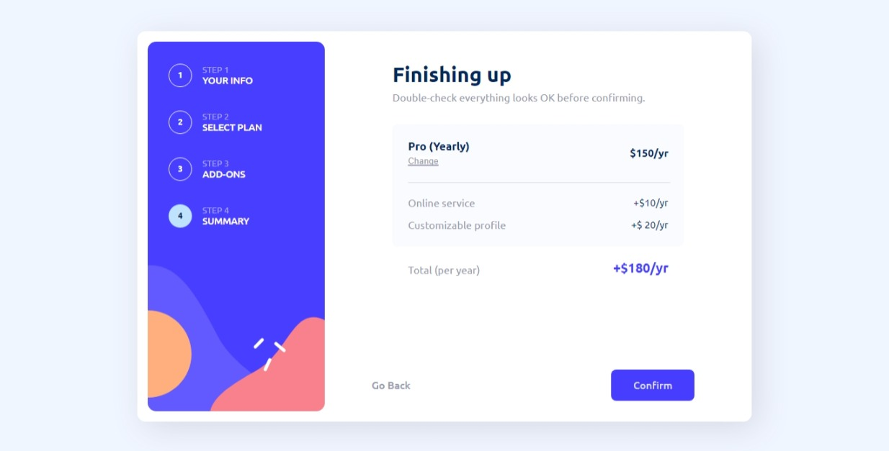
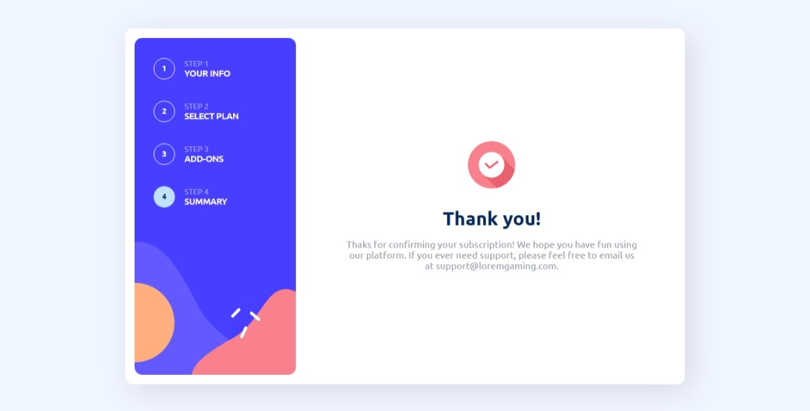
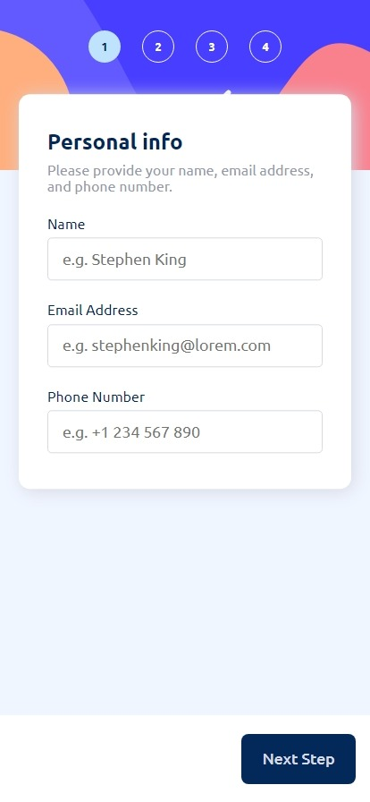
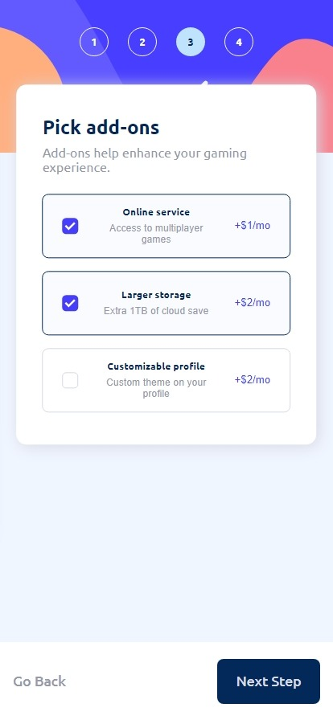
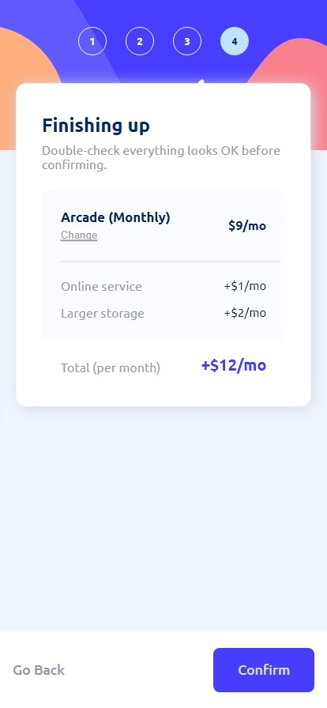
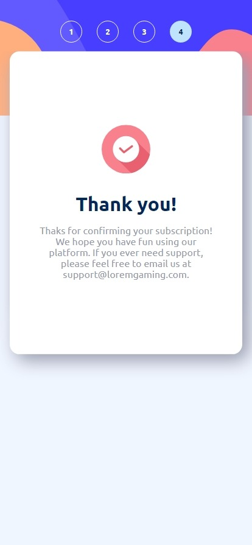

  
  # Frontend Mentor - Multi-step form solution

This is a solution to the [Multi-step form challenge on Frontend Mentor](https://www.frontendmentor.io/challenges/multistep-form-YVAnSdqQBJ). Frontend Mentor challenges help you improve your coding skills by building realistic projects.

## Table of contents

- [Overview](#overview)
  - [The challenge](#the-challenge)
  - [Screenshot](#screenshot)
  - [Links](#links)
- [My process](#my-process)
  - [Built with](#built-with)
  - [What I learned](#what-i-learned)
- [Author](#author)

## Overview

### The challenge

Users should be able to:

- Complete each step of the sequence
- Go back to a previous step to update their selections
- See a summary of their selections on the final step and confirm their order
- View the optimal layout for the interface depending on their device's screen size
- See hover and focus states for all interactive elements on the page
- Receive form validation messages if:
  - A field has been missed
  - The email address is not formatted correctly
  - A step is submitted, but no selection has been made

### Screenshot

#### Desktop design

  
  

### Movile design

  
  
  
  
  

### Links

- Solution URL: [Github code](https://github.com/DF27ARTS/Multi_Step_Form_Challenge_Mentor)
- Live Site URL: [Live site](https://df27arts.github.io/Multi_Step_Form_Challenge_Mentor)

## My process

I began by considering whether to start with the mobile or desktop design. Ultimately, I opted to begin with the desktop design as it felt more comfortable to me. Once I had the design in place, I began applying CSS styles, and once those were complete, I implemented the JavaScript.

### Built with

- Semantic HTML5 markup
- CSS custom properties
- Flexbox
- CSS Grid
- Vanila Javscript

### What I learned

Typically, I don't use vanilla JavaScript to create projects. I have used React.js and Next.js for most of my projects, but with this particular project, I had the opportunity to work more extensively with vanilla JavaScript. Through the process, I learned a lot and gained a newfound appreciation for the benefits that libraries provide. Overall, I thoroughly enjoyed every step of the process and found it to be a lot of fun.

## Author

- Website - [Fernando Rojas](https://portfoliio-three.vercel.app)
- Frontend Mentor - [@yourusername](https://www.frontendmentor.io/profile/DF27ARTS)
- Twitter - [@\_DF_Fernando](https://twitter.com/_DF_Fernando)

